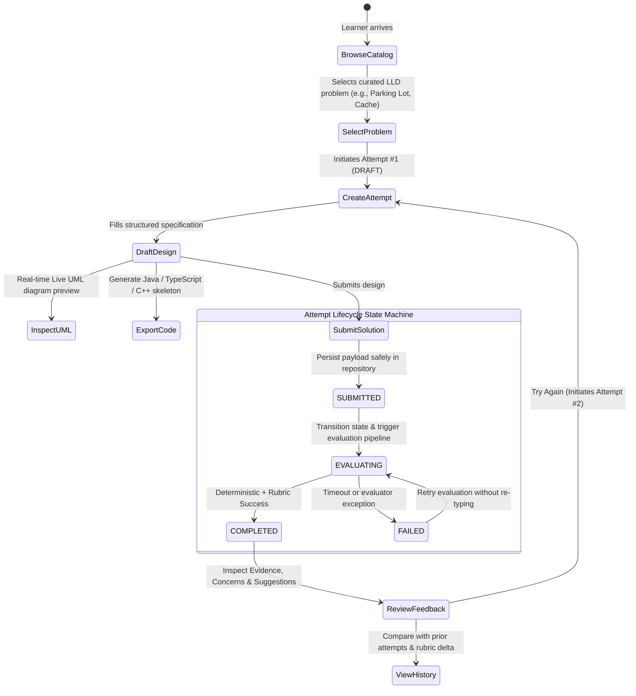

# Design Note: Architecture & Low-Level Design (LLD) Specification

**CipherSchools Engineering Hiring Assignment — System & Low-Level Design**  
*Author: Candidate Engineering Team | Date: September 2026 | Document ID: CIPHER-ENG-2026-DN-01 | Architecture: Modular Monolith*

---

## 1. Executive Summary & Architectural Philosophy

The **LLD Practice Platform** is designed as a focused, modular monolith engineered around a single core objective: **empowering software engineers to practice Low-Level Design actively and receive objective, explainable, rubric-grounded feedback across iterative attempts.**

> **Architectural Guiding Principle:** We deliberately prioritize deep, cohesive domain modeling over peripheral operational complexity. Premature microservices, distributed message brokers (Kafka/RabbitMQ), and distributed databases add network failure modes without enhancing the learner's feedback loop. The system is architected as an in-process modular monolith with clean domain seams, allowing async workers to be decoupled effortlessly when traffic demands it.

---

## 2. MVP Scope Boundaries & System Invariants

To guarantee production-grade execution within a focused scope, we established strict architectural boundaries:

| Capability Dimension | In Scope (Production MVP) | Out of Scope (Deferred with Rationale) |
| :--- | :--- | :--- |
| **Problem Catalog** | **5 Curated Scenarios**: Multi-Floor Parking Lot, Multi-Car Elevator Dispatcher, Splitwise Expense Sharing, In-Memory Cache with Pluggable Eviction, and Distributed API Rate Limiter. | Crowdsourced open problem creation and community upvoting (prevents low-quality, uncurated problems). |
| **Submission Format** | **Structured OOD Articulation**: Typed domain entities, single responsibilities, polymorphic interfaces, design patterns with justifications, and trade-off invariants. | Freeform drag-and-drop vector drawing canvas (distracts from object-oriented contract design). |
| **Visual & Code Bridge** | **Real-Time Live UML**: Dynamic visual class node rendering + Mermaid.js syntax synthesis.<br>**Polyglot Code Exporter**: Starter boilerplate in **Java 17+**, **TypeScript**, and **C++20**. | In-browser compiler execution sandbox (evaluates design contracts, not multi-language compiler toolchains). |
| **Evaluation Engine** | **Two-Stage Hybrid Engine**: Instant deterministic structural verification (<50ms) followed by rubric-grounded semantic evaluation with evidence citations. | Heavy distributed message brokers (Kafka); event-driven in-process state machine is sufficient for MVP scale. |
| **Feedback Model** | **Orthogonal Rubric Citations**: Criterion scores citing candidate classes, specific design smells/concerns, and actionable refactoring remedies. | Unconstrained single-prompt AI scores ("Looks good! 85/100") without evidence anchors. |
| **Attempt Tracking** | **Versioned History & Delta**: Audit trail of attempts ($A_1 \rightarrow A_2 \rightarrow \dots$) with mathematical rubric score progression deltas. | Public social leaderboards, user followings, or gamification badges. |

---

## 3. Learner User Flow & Lifecycle State Machine

The learner workflow is modeled as a deterministic, resilient state cycle preventing data loss and duplicate executions:



### State Machine Transition Rules
1. $\text{DRAFT} \longrightarrow \text{SUBMITTED}$: Triggered by learner submission. Payload is validated and saved immediately.
2. $\text{SUBMITTED} \longrightarrow \text{EVALUATING}$: Evaluation pipeline is engaged. Duplicate submissions are idempotently rejected.
3. $\text{EVALUATING} \longrightarrow \text{COMPLETED}$: Both deterministic checks and rubric evaluations successfully resolve. Feedback entity is attached.
4. $\text{EVALUATING} \longrightarrow \text{FAILED}$: Handled gracefully on timeout or unhandled exception. The submission payload remains safely persisted for 1-click retry.

---

## 4. Domain Model & Object-Oriented Architecture

The domain layer enforces Domain-Driven Design (DDD) encapsulation, high cohesion, and strict compliance with the **SOLID principles**.

### 4.1 Domain Class Diagram

```mermaid
classDiagram
    direction TB

    class Problem {
        +ProblemId id
        +String title
        +String summary
        +List~String~ functionalRequirements
        +List~String~ nonFunctionalRequirements
        +Rubric rubric
        +Template starterTemplate
        +getRubric() Rubric
    }

    class Attempt {
        +AttemptId id
        +ProblemId problemId
        +String learnerId
        +int attemptNumber
        +AttemptStatus status
        +DateTime createdAt
        +DateTime updatedAt
        +Submission submission
        +Feedback feedback
        +submit(Submission submission) void
        +startEvaluation() void
        +completeEvaluation(Feedback feedback) void
        +failEvaluation(String reason) void
    }

    class AttemptStatus {
        <<enumeration>>
        DRAFT
        SUBMITTED
        EVALUATING
        COMPLETED
        FAILED
    }

    class Submission~T~ {
        +SubmissionId id
        +T payload
        +DateTime submittedAt
    }

    class ISubmissionPayload {
        <<interface>>
        +SubmissionFormat format
        +validate() ValidationResult
        +toEvaluationContext() String
    }

    class StructuredDesignPayload {
        +List~EntityItem~ entities
        +List~InterfaceItem~ interfaces
        +List~PatternItem~ designPatterns
        +String tradeOffsAndAssumptions
        +String codeSnippetOrPseudocode
        +validate() ValidationResult
        +toEvaluationContext() String
    }

    class Rubric {
        +String id
        +List~RubricCriterion~ criteria
        +calculateScore(List~CriterionEvaluation~ evals) int
    }

    class Feedback {
        +String id
        +AttemptId attemptId
        +int overallScore
        +List~CriterionEvaluation~ evaluations
        +String summaryNarrative
        +DateTime evaluatedAt
    }

    class CriterionEvaluation {
        +String criterionId
        +String criterionName
        +int score
        +int maxScore
        +String evidence
        +String concern
        +String suggestion
        +float confidence
    }

    class IEvaluator {
        <<interface>>
        +evaluate(Submission sub, Rubric rub) Promise~EvaluationResult~
    }

    class DeterministicRuleEvaluator {
        +evaluate(Submission sub, Rubric rub) Promise~EvaluationResult~
    }

    class SemanticRubricEvaluator {
        +evaluate(Submission sub, Rubric rub) Promise~EvaluationResult~
    }

    class CompositeEvaluator {
        -List~IEvaluator~ evaluators
        +evaluate(Submission sub, Rubric rub) Promise~EvaluationResult~
    }

    Problem "1" *-- "1" Rubric : specifies
    Attempt "1" *-- "0..1" Submission : contains
    Attempt "1" *-- "0..1" Feedback : produces
    Attempt --> AttemptStatus : tracks
    Submission "1" *-- "1" ISubmissionPayload : encapsulates
    StructuredDesignPayload ..|> ISubmissionPayload : implements
    Feedback "1" *-- "many" CriterionEvaluation : details
    CompositeEvaluator ..|> IEvaluator : implements
    DeterministicRuleEvaluator ..|> IEvaluator : implements
    SemanticRubricEvaluator ..|> IEvaluator : implements
    CompositeEvaluator "1" o-- "many" IEvaluator : coordinates
```



### 4.2 SOLID Responsibility Analysis

| Class / Component | Primary Responsibility | Architectural Justification & SOLID Mapping |
| :--- | :--- | :--- |
| **`Problem`** | Encapsulates problem statements, operational constraints, and rubric criteria. | **Single Responsibility Principle (SRP)**: Holds immutable domain specifications; unaware of user attempts or evaluation logic. |
| **`Attempt`** | Enforces the lifecycle state machine and lifecycle invariants. | **Encapsulation & State Safety**: Guarantees legal transitions (`DRAFT` $\rightarrow$ `SUBMITTED` $\rightarrow$ `EVALUATING` $\rightarrow$ `COMPLETED`). Ensures an attempt cannot complete without feedback. |
| **`Submission<T>`** | Immutably captures what the learner submitted at a specific timestamp. | **Open-Closed Principle (OCP)**: Decoupled from concrete payload structure via `ISubmissionPayload` generic abstraction. |
| **`Rubric` & `RubricCriterion`** | Models multi-dimensional grading standards and weighted score calculations. | **High Cohesion**: Isolates grading formulas from evaluator implementations. Rubrics can be versioned independently. |
| **`IEvaluator`** | Strategy contract for evaluating candidate submissions against rubrics. | **Dependency Inversion Principle (DIP)**: Core application services depend upon `IEvaluator` abstraction, not concrete rule engines. |
| **`CompositeEvaluator`** | Coordinates deterministic checks with semantic rubric evaluations. | **Composite Pattern & OCP**: Allows chaining multiple evaluators (deterministic, semantic, human review) without modifying client code. |

---

## 5. Visual UML Synthesis & Polyglot Code Generation Engine

To eliminate the "passive reading trap" and bridge design articulation with real-world implementation, the platform incorporates dual client-side synthesis engines:

### 5.1 Real-Time Live UML Synthesis
* **Visual Class Cards**: Dynamically translates user-defined entities, responsibilities, and polymorphic interfaces into interactive visual class nodes.
* **Mermaid.js Code Generator**: Automatically formats class hierarchies and interface relationships into standard Mermaid syntax:
  ```mermaid
  classDiagram
      direction TB
      class IParkingStrategy {
          <<interface>>
          +findSpot()
      }
      class ParkingLot {
          +String id
          +executeAction()
      }
      ParkingLot ..> IParkingStrategy : delegates to
  ```
* **Clipboard Integration**: 1-click export of Mermaid source code for external documentation.

### 5.2 Polyglot Starter Code Exporter
Generates strongly typed, compilable boilerplate stubs based on the candidate's active design specification:
* **Java 17+**: Complete interface contracts, domain classes with immutable properties, design pattern annotations, and `Main` verification runner.
* **TypeScript**: ES6 exported interfaces, strongly typed class models with constructors, and execution harness.
* **C++20**: Abstract base classes with pure virtual methods, virtual destructors, modern memory management (`std::unique_ptr`), and RAII idioms.

---

## 6. Hybrid Two-Stage Evaluation Pipeline

Evaluation is split into two distinct decoupled stages to maximize speed, eliminate LLM token waste, and ensure deterministic reliability:

```
┌───────────────────────────────────────────────────────────────────────────┐
│                    TWO-STAGE HYBRID EVALUATION PIPELINE                   │
├─────────────────────────────────────┬─────────────────────────────────────┤
│ STAGE 1: Deterministic Engine       │ STAGE 2: Semantic Rubric Engine     │
│ (<50ms, Rule-Based)                 │ (Evidence-Grounded)                 │
├─────────────────────────────────────┼─────────────────────────────────────┤
│ • Validates mandatory schema fields │ • Evaluates 4 orthogonal dimensions │
│ • Verifies entity count & depth     │ • Cites explicit class names        │
│ • Checks interface method signatures│ • Flags concrete design smells      │
│ • Fast-fails incomplete submissions │ • Recommends actionable refactors   │
└─────────────────────────────────────┴─────────────────────────────────────┘
```

### 6.1 Feedback Contract Schema
Every evaluation generates a structured feedback payload adhering to a rigorous interface:
```typescript
export interface CriterionEvaluation {
  readonly criterionId: string;     // Matches rubric dimension ID
  readonly criterionName: string;   // e.g. "Single Responsibility & Cohesion"
  readonly score: number;           // 1 to 5 rating
  readonly maxScore: number;        // Typically 5
  readonly evidence: string;        // Explicit quote: "ParkingLot defines calculateFee()"
  readonly concern: string;         // Design smell: "Violates SRP by mixing fees & spots"
  readonly suggestion: string;      // Actionable remedy: "Extract IFeeCalculator strategy"
  readonly confidence: number;      // Evaluator confidence (0.0 to 1.0)
}
```

### 6.2 Weighted Score Calculation
The overall composite score is derived from criterion weights:
$$\text{Overall Score} = \sum_{i=1}^{K} \left( \frac{\text{Weight}_i}{100} \times \frac{\text{Score}_i}{\text{MaxScore}_i} \times 100 \right)$$

---

## 7. Extensibility Validation: The Two Change Tests

A critical test of object-oriented design is how gracefully it absorbs requirement changes without architectural regression. The system was validated against the two change tests specified in the brief:

### Change Test A: New Submission Formats (e.g., Class Diagram or Raw Code)
* **Requirement**: Extend the platform from text/markdown submissions to graphical class diagrams or raw source code.
* **Architectural Solution**: Encapsulated behind `ISubmissionPayload`:
  ```typescript
  export interface ISubmissionPayload {
    readonly format: SubmissionFormat;
    validate(): ValidationResult;
    toEvaluationContext(): string;
  }
  ```
* **Proof of Extensibility**: We can create `UmlDiagramPayload implements ISubmissionPayload` or `CodeSubmissionPayload implements ISubmissionPayload`. `Attempt`, `PracticeService`, and storage interfaces require **zero modifications** (verified in `tests/domain/SubmissionPayload.test.ts`).

### Change Test B: Pluggable Evaluators (e.g., Static AST Linter or Human Review)
* **Requirement**: Introduce human peer review or an AST static code linter alongside automated checks.
* **Architectural Solution**: Encapsulated behind `IEvaluator` Strategy and `CompositeEvaluator`:
  ```typescript
  export interface IEvaluator {
    readonly name: string;
    evaluate(submission: Submission, rubric: Rubric): Promise<EvaluationResult>;
  }
  ```
* **Proof of Extensibility**: To add human review, we instantiate `HumanReviewEvaluator implements IEvaluator` and register it into `new CompositeEvaluator([..., new HumanReviewEvaluator()])`. The application service orchestration remains **100% untouched** (verified in `tests/evaluators/CompositeEvaluator.test.ts`).

---

## 8. Practical Scale Roadmap & Production Evolution

| Architectural Concern | MVP Implementation | Evolution at Scale (50,000 DAU) |
| :--- | :--- | :--- |
| **System Topology** | **Modular Monolith**: In-process event handling, zero network serialization. | **Decoupled Evaluation Worker**: Extract evaluation pipeline into async worker pool (AWS ECS / Lambda). |
| **Messaging & Queues** | **In-Memory Event Dispatcher**: Direct async execution. | **Distributed Queue**: SQS or Redis Streams buffer submission tasks for worker consumption. |
| **Data Persistence** | **In-Memory Repositories**: Instant setup with clean interfaces (`IProblemRepository`, `IAttemptRepository`). | **Managed PostgreSQL**: Swap repository implementation with Prisma / TypeORM; zero domain code changes. |
| **Evaluation Engine** | **Deterministic + Rule Evaluator**: 100% local, fast, zero third-party API dependencies. | **Hybrid LLM Pool**: Local deterministic tier with rate-limited, pooled LLM workers for semantic depth. |

> **Architecture Summary:** The core domain model (`Attempt`, `Problem`, `Rubric`, `Feedback`, `Submission`) remains identical across all scaling tiers. Only the infrastructure adapters and evaluation worker deployment topology evolve.
