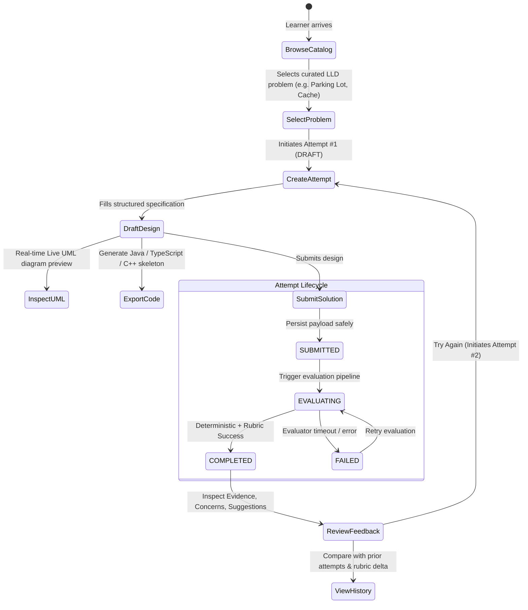

# Design Note: Architecture & Low-Level Design of the LLD Practice Platform

**Author:** LLD Practice Platform Team  
**Date:** September 2026  
**Assignment:** CipherSchools Engineering Hiring Assignment  
**Focus:** MVP Definition, Domain Architecture, Design Patterns, Trade-offs & Extensibility  

---

## 1. Executive Summary & MVP Scope

The **LLD Practice Platform** is engineered as a focused, modular monolith designed around a single core learner problem: providing objective, rubric-grounded, explainable design feedback that powers iterative improvement.

In accordance with good engineering judgment, we deliberately reject bloated peripheral systems (such as multi-tenant authentication, collaborative diagram whiteboards, or distributed microservice orchestration) in favor of deep, cohesive domain modeling.

### 1.1 Scope Boundaries

| Capability | In Scope (MVP) | Out of Scope (Deferred with Rationale) |
| :--- | :--- | :--- |
| **Problem Catalog** | 5 curated LLD problems (Parking Lot, Elevator Dispatcher, Splitwise, Cache System with LRU/LFU/FIFO, API Rate Limiter) with business invariants and rubrics. | Crowdsourced problem creation and uncurated community voting. |
| **Submission Format** | Structured design specification (Core Entities, Responsibilities, Interfaces, Patterns, Trade-offs). | Heavy free-form graphical drag-and-drop vector drawing tools. |
| **Visual & Code Bridge** | Dynamic Live UML class diagram synthesis and multi-language boilerplate code generator (Java, TypeScript, C++). | Full in-browser compiler sandbox or multi-language execution runtime. |
| **Evaluation Engine** | Hybrid two-stage evaluation: Deterministic Rule Evaluator + Rubric Evaluator with concrete evidence citations. | Heavy distributed message broker (Kafka/RabbitMQ); modular in-process state transitions are sufficient for MVP. |
| **Feedback Model** | Multi-dimensional rubric feedback citing concrete evidence, design concerns, and remedies. | Vague, single-prompt subjective AI grading ("Looks good! 85/100"). |
| **Attempt Tracking** | Versioned attempt history ($A_1, A_2, \dots$) with rubric delta comparison and score progression. | Social leaderboards, public user profiles, or gamification badges. |

---

## 2. Learner User Flow

The platform guides the learner through an active feedback-driven state cycle:



---

## 3. Domain Model & Object-Oriented Design

The core domain adheres strictly to SOLID principles, DDD (Domain-Driven Design) layering, and clean separation between domain entities, value objects, and evaluation strategies.

### 3.1 Domain Class Diagram

```mermaid
classDiagram
    class Problem {
        +ProblemId id
        +String title
        +String description
        +List~String~ functionalRequirements
        +List~String~ nonFunctionalRequirements
        +Rubric rubric
        +Template starterTemplate
        +getRubric() Rubric
    }

    class Attempt {
        +AttemptId id
        +ProblemId problemId
        +String learnerId
        +int attemptNumber
        +AttemptStatus status
        +DateTime createdAt
        +DateTime updatedAt
        +Submission submission
        +Feedback feedback
        +submit(Submission submission) void
        +startEvaluation() void
        +completeEvaluation(Feedback feedback) void
        +failEvaluation(String reason) void
    }

    class AttemptStatus {
        <<enumeration>>
        DRAFT
        SUBMITTED
        EVALUATING
        COMPLETED
        FAILED
    }

    class Submission {
        +SubmissionId id
        +SubmissionFormat format
        +ISubmissionPayload payload
        +DateTime submittedAt
        +getPayload() ISubmissionPayload
    }

    class ISubmissionPayload {
        <<interface>>
        +validate() ValidationResult
        +getSummary() String
    }

    class StructuredDesignPayload {
        +List~EntitySpec~ entities
        +List~InterfaceSpec~ interfaces
        +List~PatternSpec~ designPatterns
        +String tradeOffsAndAssumptions
        +validate() ValidationResult
        +getSummary() String
    }

    class Rubric {
        +RubricId id
        +List~RubricCriterion~ criteria
        +getMaxScore() int
    }

    class RubricCriterion {
        +String id
        +String name
        +String description
        +int weight
        +int maxScore
    }

    class Feedback {
        +FeedbackId id
        +int overallScore
        +List~CriterionEvaluation~ evaluations
        +String summary
        +DateTime evaluatedAt
    }

    class CriterionEvaluation {
        +String criterionId
        +int score
        +int maxScore
        +String evidence
        +String concern
        +String suggestion
        +float confidence
    }

    class IEvaluator {
        <<interface>>
        +evaluate(Submission submission, Rubric rubric) Promise~EvaluationResult~
    }

    class DeterministicRuleEvaluator {
        +evaluate(Submission submission, Rubric rubric) Promise~EvaluationResult~
    }

    class SemanticRubricEvaluator {
        +evaluate(Submission submission, Rubric rubric) Promise~EvaluationResult~
    }

    class CompositeEvaluator {
        -List~IEvaluator~ evaluators
        +evaluate(Submission submission, Rubric rubric) Promise~EvaluationResult~
    }

    Problem "1" *-- "1" Rubric : specifies
    Attempt "1" *-- "0..1" Submission : contains
    Attempt "1" *-- "0..1" Feedback : produces
    Attempt --> AttemptStatus : tracks
    Submission "1" *-- "1" ISubmissionPayload : encapsulates
    StructuredDesignPayload ..|> ISubmissionPayload : implements
    Feedback "1" *-- "many" CriterionEvaluation : details
    CompositeEvaluator ..|> IEvaluator : implements
    DeterministicRuleEvaluator ..|> IEvaluator : implements
    SemanticRubricEvaluator ..|> IEvaluator : implements
    CompositeEvaluator "1" o-- "many" IEvaluator : coordinates
```



---

## 4. Key Responsibilities of Domain Classes

| Class / Interface | Primary Responsibility | Justification & SOLID Adherence |
| :--- | :--- | :--- |
| **`Problem`** | Encapsulates problem statements, constraints, and rubric definitions. | **Single Responsibility Principle (SRP)**: Holds domain problem invariants; does not know about user attempts or evaluation mechanics. |
| **`Attempt`** | Manages the lifecycle state machine of a learner's solution effort. | **Encapsulation & State Invariants**: Enforces legal state transitions (`DRAFT` $\rightarrow$ `SUBMITTED` $\rightarrow$ `EVALUATING` $\rightarrow$ `COMPLETED`). Guarantees an attempt cannot be marked completed without valid feedback. |
| **`Submission<T>`** | Immutably captures what the learner submitted at a point in time. | **Open-Closed Principle (OCP)**: Uses generic `ISubmissionPayload` to decouple the attempt from the format of the solution. |
| **`Rubric` & `RubricCriterion`** | Models the multi-dimensional criteria against which designs are judged. | Decouples grading rules from both problems and evaluators. Rubrics can be versioned or customized per problem type. |
| **`IEvaluator`** | Strategy contract for evaluating a submission against a rubric. | **Dependency Inversion Principle (DIP)**: Application services depend on the `IEvaluator` abstraction, not concrete AI or rule engines. |
| **`CompositeEvaluator`** | Coordinates deterministic checks with semantic AI evaluations. | **Composite & Open-Closed Patterns**: Allows chaining any number of evaluators without altering the calling service. |

### 4.1 Visual UML Synthesis & Polyglot Code Generation

To prevent the "passive reading trap" and reinforce the bridge between design thinking and real-world implementation, the platform incorporates dual synthesis engines:
* **Dynamic Live UML Synthesis**: Translates the learner's declared entities, responsibilities, and interfaces into interactive visual class nodes and standard Mermaid.js class diagrams in real time.
* **Polyglot Code Exporter**: Automatically translates the structured design specification into strongly typed, compilable boilerplate across **Java** (interfaces, immutability, thread-safe patterns), **TypeScript** (typed interfaces, ES6 classes), and **C++** (abstract base classes, virtual destructors, modern C++20 pointers).

---

## 5. Evaluation & Feedback Approach

Evaluation is structured into a two-phase pipeline to maximize reliability and speed while minimizing costs:

```mermaid
flowchart LR
    Sub[Learner Submission] --> Comp[Composite Evaluator]
    
    subgraph Phase 1: Deterministic Engine (<50ms)
        Comp --> DET[Deterministic Rule Evaluator]
        DET --> D1{Schema & Completeness Valid?}
        D1 -- No --> FailFast[Fail Fast: Highlight Missing Sections]
        D1 -- Yes --> RuleScore[Calculate Structural Score]
    end
    
    subgraph Phase 2: Semantic Rubric Engine
        RuleScore --> LLM[Semantic Rubric Evaluator]
        LLM --> Prompt[Inject Structured Rubric & Evidence Anchor]
        Prompt --> Parse[Validate Structured JSON Response]
    end
    
    Parse --> Merge[Synthesize Overall Feedback]
    FailFast --> Merge
    Merge --> Res[Return Unified Feedback]
```

### 5.1 Deterministic Checks
* **Section Coverage**: Ensures all mandatory components (Entities, Responsibilities, Interfaces, Pattern justifications, Assumptions) are present.
* **Relationship Integrity**: Verifies that referenced interfaces and classes are actually declared.
* **Minimum Elaboration Depth**: Flags placeholder or one-word descriptions before wasting LLM tokens.

### 5.2 Semantic Checks (Rubric-Grounded)
The semantic engine does not ask the LLM *"Is this design good?"* (which results in inconsistent grades). Instead, it evaluates 4 strict orthogonal dimensions:
1. **Domain Modeling & Completeness**: Did the design capture all core entities required by the problem?
2. **Single Responsibility & Cohesion (SRP)**: Are class responsibilities focused, or do "God objects" exist?
3. **Coupling & Extensibility (OCP / DIP)**: Are algorithms and behaviors abstracted behind interfaces (e.g. Strategy/Factory patterns)?
4. **Trade-offs & Constraints**: Did the candidate explain why they chose their design and what trade-offs were accepted?

### 5.3 Feedback Shape
Every criterion evaluation adheres to a strict contract:
* `criterionId`: Identifier matching the problem rubric.
* `score`: 1 to 5.
* `evidence`: Explicit citation of class/method names from the candidate's submission.
* `concern`: Concrete failure scenario or design smell.
* `suggestion`: Specific pattern or refactoring to address in the next attempt.
* `confidence`: Evaluator certainty score (0.0 – 1.0).

---

## 6. The Two Change Tests

A critical test of domain design is how gracefully it absorbs change. Our architecture was specifically tested against the two scenarios highlighted in the hiring brief:

### Change Test A: Supporting a New Submission Format (e.g., UML Class Diagram or Code)
* **The Challenge**: Today the platform accepts structured markdown/text. Tomorrow it must support a UML Class Diagram or raw Java/TypeScript code.
* **How Our Architecture Absorbs It**:
  1. We defined `ISubmissionPayload`:
     ```typescript
     export interface ISubmissionPayload {
       format: SubmissionFormat; // 'STRUCTURED_TEXT' | 'UML_DIAGRAM' | 'CODE'
       validate(): ValidationResult;
       toEvaluationContext(): string;
     }
     ```
  2. To support UML diagrams, we implement `UmlDiagramPayload implements ISubmissionPayload` containing diagram nodes/edges or Mermaid/PlantUML syntax.
  3. `Attempt`, `PracticeService`, and the database schema remain **completely unchanged**. The `Submission` entity wraps any payload adhering to `ISubmissionPayload`.

### Change Test B: Adding a New Evaluator (e.g., Static AST Linter or Human Review)
* **The Challenge**: Today feedback is generated by automated rules and an LLM. Tomorrow we add a rule-based AST linter or asynchronous human peer review.
* **How Our Architecture Absorbs It**:
  1. Evaluators implement `IEvaluator`:
     ```typescript
     export interface IEvaluator {
       readonly name: string;
       evaluate(submission: Submission, rubric: Rubric): Promise<EvaluationResult>;
     }
     ```
  2. To add human review, we simply create `HumanReviewEvaluator implements IEvaluator`.
  3. We register `new HumanReviewEvaluator()` into `CompositeEvaluator`:
     ```typescript
     const evaluator = new CompositeEvaluator([
       new DeterministicRuleEvaluator(),
       new SemanticRubricEvaluator(),
       new HumanReviewEvaluator() // <-- Plugs in seamlessly!
     ]);
     ```
  4. The practice flow (`PracticeService.submitSolution()`) does not change by a single line. It simply invokes `this.evaluator.evaluate()`.

---

## 7. Practical Scale & Architectural Trade-offs

| Decision | Chosen Approach | Alternative Considered | Rationale & Trade-off |
| :--- | :--- | :--- | :--- |
| **System Architecture** | **Modular Monolith** | Microservices (Service per feature) | For a practice platform prototype, a clean monolith eliminates network serialization, distributed transactions, and deployment complexity while maintaining strict domain boundaries. |
| **Evaluation Timing** | **Asynchronous Lifecycle with Immediate Save** | Synchronous blocking HTTP request | LLM evaluation takes 2–5 seconds. Blocking the HTTP connection risks browser timeouts and loses submissions if the network drops. We save the attempt as `SUBMITTED` first, then transition to `EVALUATING` asynchronously. |
| **State Storage** | **Domain Repository Interface (In-Memory + File Persistence)** | Distributed Database (PostgreSQL / DynamoDB) | Adheres to Dependency Inversion. The repository interface (`IAttemptRepository`) allows switching to a cloud database without touching domain logic, while keeping the prototype zero-setup for reviewers. |
| **Idempotency & Retries** | **Attempt-Level State Machine** | Uncontrolled client re-requests | If a learner clicks "Submit" twice, the state machine recognizes `SUBMITTED` or `EVALUATING` and rejects duplicate evaluation jobs. If an evaluation fails, the attempt transitions to `FAILED` and can be retried without re-typing. |

### Component Separation Roadmap
If the platform scales to 50,000 daily active learners, the **first and only component to extract** is the **Evaluation Worker Pool**:
* The web monolith continues handling problems, attempt management, and submission ingestion.
* When a submission is saved, a lightweight event (`SubmissionCreatedEvent`) is published to a job queue (e.g., AWS SQS or Redis Streams).
* Independent evaluation worker nodes consume from the queue, execute `CompositeEvaluator`, and write the resulting `Feedback` back to the database.
* The domain entities (`Attempt`, `Submission`, `Rubric`, `Feedback`) remain identical.
