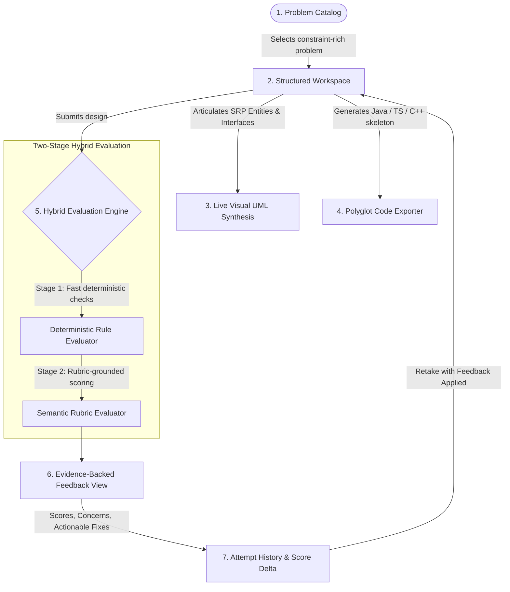

# Research Note: Re-architecting the Low-Level Design (LLD) Practice Loop

| Metadata Field | Document Specification |
| :--- | :--- |
| **Document ID** | `CIPHER-ENG-2026-RN-01` |
| **Assignment Track** | CipherSchools Engineering Hiring Assignment — Software Architecture & LLD |
| **Author** | Candidate Engineering Team |
| **Submission Status** | Final Publication Release |
| **Effective Date** | September 2026 |
| **Domain Focus** | Object-Oriented Design (OOD), Cognitive Practice Gaps, Evaluation Mechanics |

---

## 1. Executive Summary

Low-Level Design (LLD) and Object-Oriented Design (OOD) represent pivotal hiring competencies for Software Engineers across top technology organizations. While Data Structures & Algorithms (DSA) benefit from mature, deterministic practice ecosystems (e.g., LeetCode, HackerRank, Codeforces), **Low-Level Design practice remains profoundly broken**.

> [!IMPORTANT]
> **The Core Problem**: In DSA, correctness is verified through binary runtime test cases ($f(x) = y$). In Low-Level Design, **two entirely different architectures for the same problem can both be correct**, depending on scale, concurrency, and trade-offs. Without objective, rubric-grounded evaluation and evidence citations, self-practice degenerates into the "passive reading trap" or arbitrary LLM hallucinations.

This research note examines the cognitive failure modes of self-guided LLD practice, evaluates existing industry solutions across four structural dimensions, identifies three critical market gaps, and outlines a resilient product direction engineered around a focused, iterative feedback loop.

---

## 2. The Learner Problem: Why LLD Practice is Broken

Through analysis of candidate preparation workflows and system design interview evaluations, we identified four interconnected failure stages in the learner journey:

```
┌─────────────────────────┐       ┌─────────────────────────┐
│ 1. Ambiguity of Multiple│  ──>  │ 2. The "Passive Reading"│
│    Valid Architectural  │       │    Illusion of Mastery  │
│    Truths               │       │                         │
└─────────────────────────┘       └─────────────────────────┘
             │                                 │
             ▼                                 ▼
┌─────────────────────────┐       ┌─────────────────────────┐
│ 3. The Evaluative Black │  ──>  │ 4. Absence of an        │
│    Hole (No Evidence)   │       │    Iterative Delta Loop │
│                         │       │    (A1 -> A2)           │
└─────────────────────────┘       └─────────────────────────┘
```

### 2.1 The Ambiguity of "Multiple Valid Truths"
In algorithmic problem-solving, the solution space converges on optimal asymptotic bounds ($\mathcal{O}(N \log N)$, $\mathcal{O}(1)$ space). Conversely, Low-Level Design problems exhibit a divergent solution space:
* A parking lot using a synchronized `List<ParkingSpot>` is optimal for small, single-floor garages.
* An enterprise multi-floor facility requires an abstract `ParkingStrategy` (Strategy Pattern), decoupled observer event dispatchers for floor occupancy display boards, and fine-grained lock striping.

Without structural guidance, learners conflate **functional completeness** with **design excellence**. If their code compiles or pseudocode passes a rudimentary manual trace, they assume their design is production-ready, unaware of latent God classes or leaky abstractions.

### 2.2 The "Passive Reading" Trap
Because interactive LLD tools are scarce, candidates disproportionately consume passive media: YouTube walkthroughs, blog posts, and GitHub repositories with static class diagrams. When reviewing an expert's finalized UML diagram, architectural choices appear self-evident in hindsight. However, in an unprompted interview setting, the learner struggles to decompose business requirements into cohesive domain entities, identify boundary invariants, and decouple interfaces.

### 2.3 The Evaluative Black Hole
Upon drafting a design on paper, in markdown, or in an IDE, the candidate faces questions that self-study cannot answer:
1. *Did I violate the Single Responsibility Principle by combining parking fee calculation with ticket persistence?*
2. *Is `Vehicle` tightly coupled to concrete spot allocations?*
3. *Will this class hierarchy survive when an Electric Vehicle charging station requirement is introduced?*
4. *Did I introduce unnecessary design patterns (e.g., Abstract Factory) where a simple factory method was sufficient?*

### 2.4 Absence of an Iterative Delta Loop
Mastery requires feedback followed by immediate re-application. In current practice, candidates rarely revise an attempted problem because they lack an objective delta metric to verify whether **Attempt 2 ($A_2$)** addressed the design flaws of **Attempt 1 ($A_1$)**.

---

## 3. Analysis of Existing Market Solutions

We benchmarked current alternatives against four core evaluative criteria:

| Platform Category | Representative Examples | Practice Model | Feedback Mechanism | Critical Structural Deficiencies |
| :--- | :--- | :--- | :--- | :--- |
| **DSA Platforms** | LeetCode, HackerRank | Code execution against unit test fixtures | Binary execution output (Pass, Fail, TLE, OOM) | Measures time complexity and I/O correctness only. Completely blind to coupling, cohesion, SOLID adherence, and abstraction leaks. |
| **Passive Content Sites** | Educative (Grokking OOD), YouTube | Static reading of expert reference solutions | Self-assessment against diagrams | Zero interactive submission. Fosters passive memorization rather than original decomposition skills. |
| **Human Peer Mocks** | Pramp, Interviewing.io | 1-on-1 scheduled mock interviews | Subjective verbal peer notes | High financial cost, scheduling friction, and high evaluator variance. Cannot support daily iterative practice. |
| **Unconstrained LLMs** | ChatGPT, Claude (Chat Interface) | Freeform text prompts: *"Review my parking lot design"* | Conversational prose and arbitrary ratings ("8/10, looks good!") | Hallucinatory ratings, moving evaluation baselines across turns, sycophantic praise of trivial naming, and lack of versioned attempt tracking. |

> [!NOTE]
> **Key Finding on LLMs**: Unconstrained LLM prompts generate deceptive feedback. Because LLMs are trained to be helpful conversationalists, they routinely praise poorly coupled designs. To make machine evaluation pedagogically rigorous, the model must be constrained to a **deterministic, evidence-backed rubric** requiring explicit citation of class names, methods, and responsibilities.

---

## 4. Identified Market Gaps

From our comparative audit, three foundational unmet needs emerge:

```
┌───────────────────────────────────────────────────────────────────────────┐
│                          FOUNDATIONAL MARKET GAPS                         │
├──────────────────────────┬───────────────────────┬────────────────────────┤
│ 1. Multi-Dimensional     │ 2. Grounded Evidence  │ 3. Versioned Attempt   │
│    Rubrics               │    Citations          │    Progression Deltas  │
│                          │                       │                        │
│ Must dissect designs     │ Must cite specific    │ Must track improvement │
│ across SRP, Abstraction, │ classes and methods;  │ mathematically:        │
│ Cohesion, and Trade-offs │ vague advice like     │ ΔScore = Score(A2) -   │
│ rather than a single     │ "improve coupling" is │          Score(A1)     │
│ arbitrary score.         │ useless to a learner. │                        │
└──────────────────────────┴───────────────────────┴────────────────────────┘
```

---

## 5. Product Direction: The LLD Practice Studio

Rather than building a sprawling learning management system or a heavyweight collaborative whiteboard, our platform executes **one core learner loop with absolute precision**:

> **"Provide software engineers with an active, focused studio to articulate structured object-oriented designs, receive deterministic structural validation and evidence-grounded rubric evaluations, and systematically track improvement across versioned attempts."**

### 5.1 The End-to-End Learner Journey



### 5.2 Core Architectural Principles

1. **Curated, Constraint-Rich Scenarios**:
   Includes 5 high-frequency enterprise design scenarios (Multi-Floor Parking Lot, Multi-Car Elevator Dispatcher, Splitwise Expense Sharing, High-Throughput In-Memory Cache with Pluggable Eviction, and Distributed API Rate Limiter). Each problem defines explicit operational invariants and concurrency constraints.

2. **Structured Submission Model**:
   Replaces unstructured freeform text with typed domain components:
   * **Domain Entities & Responsibilities** (Enforces Single Responsibility Principle).
   * **Interfaces & Contracts** (Enforces Dependency Inversion and Open-Closed Principle).
   * **Design Patterns with Justifications** (Prevents pattern stuffing).
   * **Concurrency Invariants & Trade-offs** (Assumptions, thread safety, race condition mitigations).

3. **Active Visual & Implementation Bridge**:
   * **Live UML Class Diagram**: Synthesizes declared classes and interfaces into real-time interactive visual class cards and standard Mermaid.js diagrams.
   * **Polyglot Boilerplate Generator**: Translates the abstract design specification into strongly typed, compilable boilerplate in **Java 17+**, **TypeScript**, and **C++20**, eliminating the barrier between conceptual design and production code.

4. **Two-Stage Hybrid Evaluation Engine**:
   * *Stage 1 (Deterministic)*: Executes sub-50ms checks verifying structural completeness, mandatory entity counts, interface contracts, and minimum elaboration depth.
   * *Stage 2 (Rubric-Grounded Semantic)*: Evaluates orthogonal rubric criteria where every score must provide **Evidence** (citing candidate classes/methods), **Identified Concerns** (concrete edge cases or smells), and **Remediation Suggestions**.

5. **Stateful Attempt Lifecycle & Delta Tracking**:
   The lifecycle is governed by an explicit finite state machine:
   $$\text{DRAFT} \longrightarrow \text{SUBMITTED} \longrightarrow \text{EVALUATING} \longrightarrow \text{COMPLETED} \ (\text{or } \text{FAILED})$$
   Submissions are persisted immediately upon arrival, guaranteeing zero data loss, idempotency against duplicate clicks, and mathematical score progression comparison:
   $$\Delta \text{Score} = \text{Score}(A_{t+1}) - \text{Score}(A_t)$$

6. **Evolutionary Seams (Change Tests A & B)**:
   Engineered with polymorphic seams (`ISubmissionPayload` and `IEvaluator`) allowing immediate extension to support diagram payloads, code linters, or human peer review without altering application orchestration.

---

## 6. Summary of Expected Learning Outcomes

By shifting LLD practice from passive observation to structured active articulation, learners achieve three measurable transformations:
1. **Elimination of God Classes**: Explicit single responsibility fields force learners to decouple coordinators from business rules.
2. **Defensive Concurrency Modeling**: Requiring explicit trade-off explanations compels candidates to address race conditions before writing pseudocode.
3. **Calibrated Interview Readiness**: Objective rubric citations mirror senior engineering hiring bars, equipping candidates with explainable design vocabulary.
